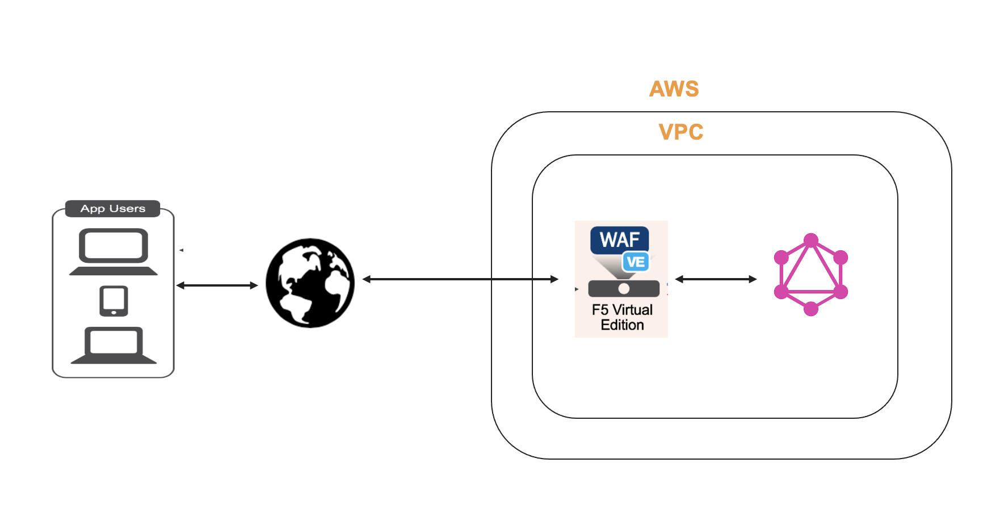

## Scenario: Deploying BIG-IP VE to Secure a GraphQL Application With F5 AWAF Using Terraform Module and BIG-IP provider

* The purpose of this example is to demo the impact of applying a GraphQL profile (available from v16.1) to a WAF policy, securing a vulnerable GraphQL application.

### Demo Diagram :



### Module Usage :

```hcl
module bigip{
  source                     = "F5Networks/bigip-module/aws"
  count                      = var.instance_count
  prefix                     = format("%s-3nic", var.prefix)
  ec2_key_name               = aws_key_pair.generated_key.key_name
  f5_ami_search_name         = var.f5_ami_search_name
  mgmt_subnet_ids            = [{ "subnet_id" = aws_subnet.mgmt.id, "public_ip" = true, "private_ip_primary" = "" }]
  mgmt_securitygroup_ids     = [module.mgmt-network-security-group.security_group_id]
  external_securitygroup_ids = [module.external-network-security-group-public.security_group_id]
  internal_securitygroup_ids = [module.internal-network-security-group-public.security_group_id]
  external_subnet_ids        = [{ "subnet_id" = aws_subnet.external-public.id, "public_ip" = true, "private_ip_primary" = "", "private_ip_secondary" = "" }]
  internal_subnet_ids        = [{ "subnet_id" = aws_subnet.internal.id, "public_ip" = false, "private_ip_primary" = "" }]
  custom_user_data = templatefile("custom_onboard_big.tmpl", {
    bigip_username         = var.f5_username
    ssh_keypair            = aws_key_pair.generated_key.key_name
    aws_secretmanager_auth = false
    bigip_password         = random_string.password.result
    INIT_URL               = var.INIT_URL,
    DO_URL                 = var.DO_URL,
    DO_VER                 = format("v%s", split("-", split("/", var.DO_URL)[length(split("/", var.DO_URL)) - 1])[3])
    AS3_URL                = var.AS3_URL,
    AS3_VER                = format("v%s", split("-", split("/", var.AS3_URL)[length(split("/", var.AS3_URL)) - 1])[2])
    TS_VER                 = format("v%s", split("-", split("/", var.TS_URL)[length(split("/", var.TS_URL)) - 1])[2])
    TS_URL                 = var.TS_URL,
    CFE_URL                = var.CFE_URL,
    CFE_VER                = format("v%s", split("-", split("/", var.CFE_URL)[length(split("/", var.CFE_URL)) - 1])[3])
    FAST_URL               = var.FAST_URL,
    FAST_VER               = format("v%s", split("-", split("/", var.FAST_URL)[length(split("/", var.FAST_URL)) - 1])[3])
  })
  sleep_time = "1000s"
  depends_on = [aws_route_table_association.route_table_mgmt, aws_route_table_association.route_table_external,
    aws_route_table_association.route_table_internal, module.external-network-security-group-public,
  module.internal-network-security-group-public, module.mgmt-network-security-group]
}
```

* Example deploys 3 NIC BIG-IP with Required Module provision(`asm`) using `runtime-init`.
* It also deploy vulnerable GraphQL application.
* After BIG-IP is deployed,terraform BIG-IP provider used for configuring All the required config objects for protecting GraphQL Application.plese see [bigip](https://github.com/F5Networks/terraform-aws-bigip-module/blob/main/examples/bigip_aws_3nic_deploy_awaf/bigip.tf) terraform config file for more details on resource being used.

### Variable specifications

- Modify `terraform.tfvars` according to the requirement by changing `f5_ami_search_name`, `region` and `AllowedIPs` variables as follows:

    ```hcl
    region = "ap-south-1"
    f5_ami_search_name = "*BIGIP-16.1.3*PAYG-Adv WAF Plus 25Mbps-*"
    AllowedIPs = ["0.0.0.0/0"]
    
    ```

- Next, run the following commands to create and destroy your configuration

    ```shell
    terraform init
    terraform plan
    terraform apply
    terraform destroy
    ```

#### Optional Input Variables

| Name | Description | Type | Default |
|------|-------------|------|---------|
| prefix | Prefix for resources created by this module | `string` | tf-aws-bigip |
| cidr | aws VPC CIDR | `string` | 10.2.0.0/16 |
| availabilityZones | If you want the VM placed in an Availability Zone, and the AWS region you are deploying to supports it, specify the numbers of the existing Availability Zone you want to use | `List` | ["us-east-1a"] |

#### Output Variables

| Name | Description |
|------|-------------|
| mgmtPublicIP | The actual ip address allocated for the resource |
| mgmtPublicDNS | fqdn to connect to the first vm provisioned |
| mgmtPort | Mgmt Port |
| f5\_username | BIG-IP username |
| bigip\_password | BIG-IP Password (if dynamic_password is choosen it will be random generated password or if aws_secretmanager_auth is choosen it will be aws_secretsmanager_secret_version secret string ) |
| mgmtPublicURL | Complete url including DNS and port|
| private\_addresses | List of BIG-IP private addresses |
| public\_addresses | List of BIG-IP public addresses |
| vpc\_id | VPC Id where BIG-IP Deployed |